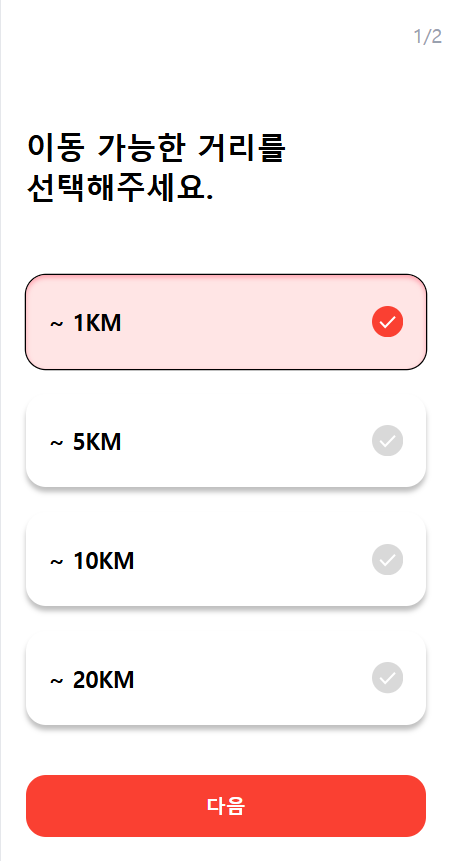
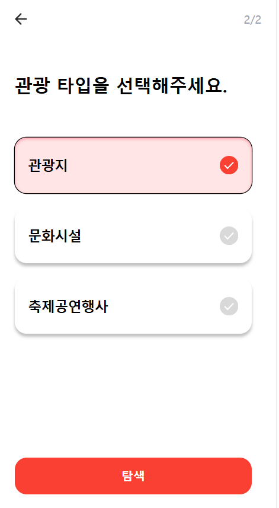
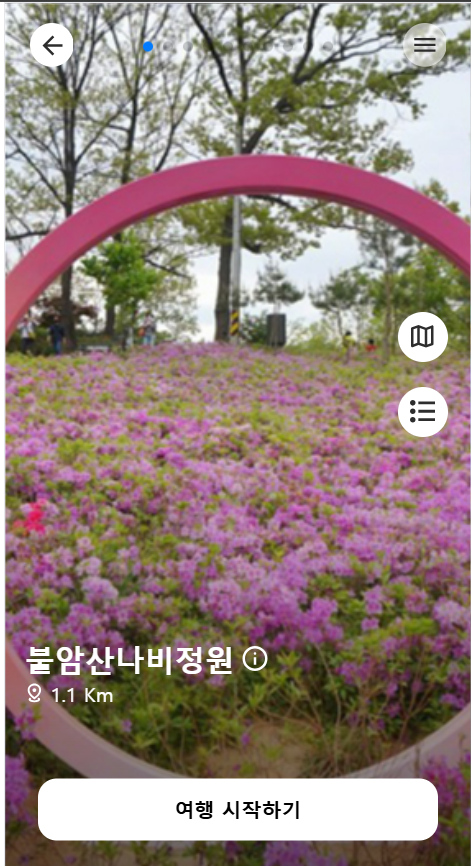
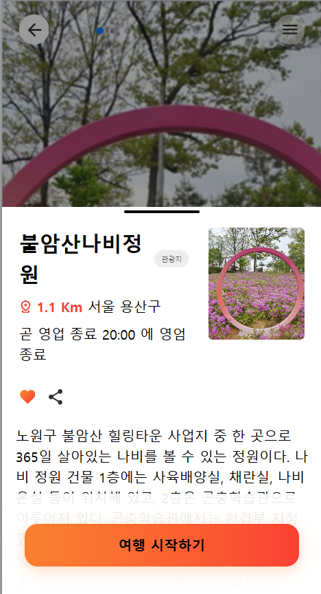
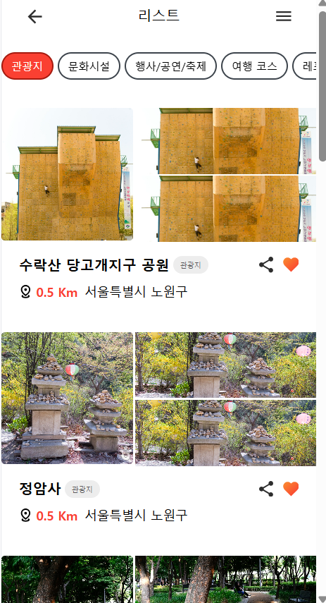
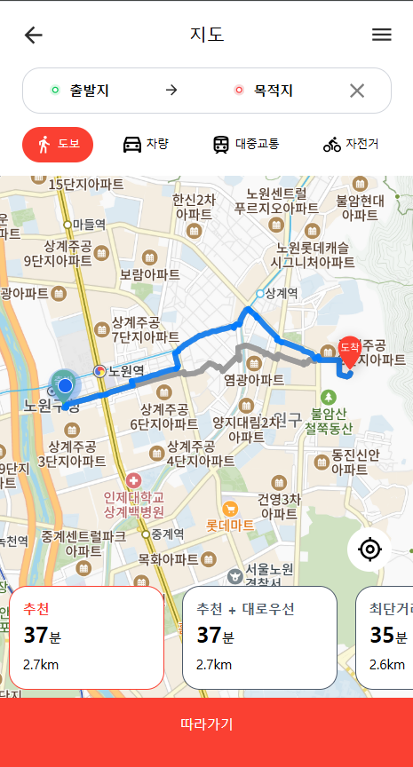
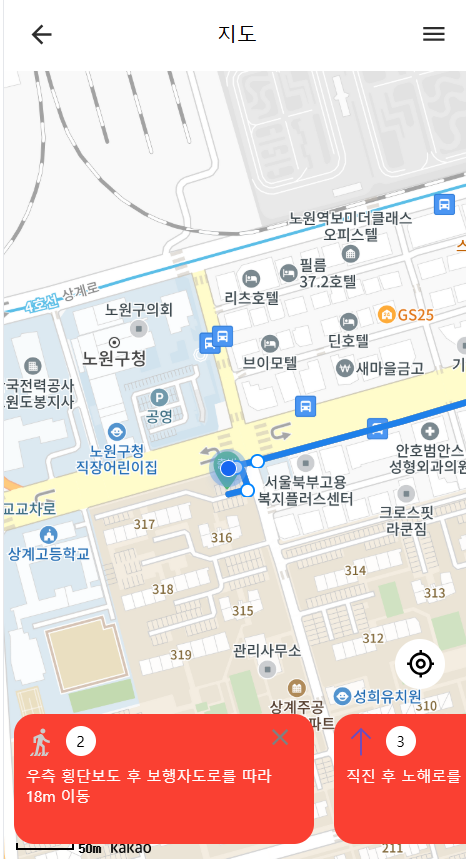
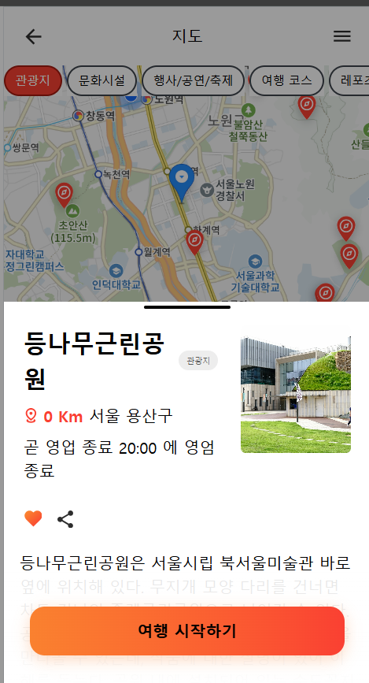

## 사이트 소개

⭐ 숏폼 형식의 UI를 통해서 간편하게 현재 위치를 기준으로 주변 관광지를 탐색할 수 있습니다.

⭐ 관광지를 정했다면, 지도를 통해서 길찾기 기능을 지원합니다.

⭐ 내가 가려는 관광지 기준에서 주변의 관광지를 탐색하는 기능을 지원해 끊김없는 여행이 가능하도록 합니다.

 

## 미리보기

|                                         |                                         |                                         |
| :-------------------------------------: | :-------------------------------------: | :-------------------------------------: |
|  |  |  |
|  |  |  |
|  |  |  |
